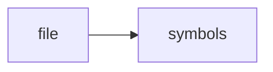

# test_todo_engine.cpp

> **Language**: `cpp` | **Symbols**: 2

## Purpose

Defines 2 indexed symbol(s): top_level, main.

## Public Symbols

| Symbol | Type | Lines | Description |
|---|---|---:|---|
| [[symbols/ragd/tests/top_level-L1-22e60423|top_level]] | block | 1-2 | top_level |
| [[symbols/ragd/tests/main-L3-a5a3d2fe|main]] | function | 3-9 | main |

## Imports

- *(none indexed)*

## Call Graph

## Recent Changes

> Content hash: `a5a3d2fec28f8fe4`. Last modified epoch: `-4659111330457280177`.
