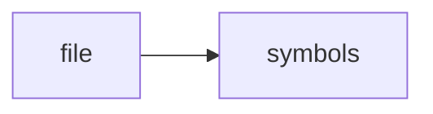

# test_vector_store.cpp

> **Language**: `cpp` | **Symbols**: 2

## Purpose

Defines 2 indexed symbol(s): top_level, main.

## Public Symbols

| Symbol | Type | Lines | Description |
|---|---|---:|---|
| [[symbols/ragd/tests/top_level-L1-c4ec48d2|top_level]] | block | 1-2 | top_level |
| [[symbols/ragd/tests/main-L3-7d9e4a16|main]] | function | 3-11 | main |

## Imports

- *(none indexed)*

## Call Graph

## Recent Changes

> Content hash: `7d9e4a16a822dd74`. Last modified epoch: `-4659111330461280177`.
