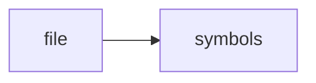

# test_watcher.cpp

> **Language**: `cpp` | **Symbols**: 2

## Purpose

Defines 2 indexed symbol(s): top_level, main.

## Public Symbols

| Symbol | Type | Lines | Description |
|---|---|---:|---|
| [[symbols/ragd/tests/top_level-L1-e81b977d|top_level]] | block | 1-10 | top_level |
| [[symbols/ragd/tests/main-L11-561bce13|main]] | function | 11-35 | main |

## Imports

- *(none indexed)*

## Call Graph

## Recent Changes

> Content hash: `561bce13eceb0f2f`. Last modified epoch: `-4659109274045561463`.
