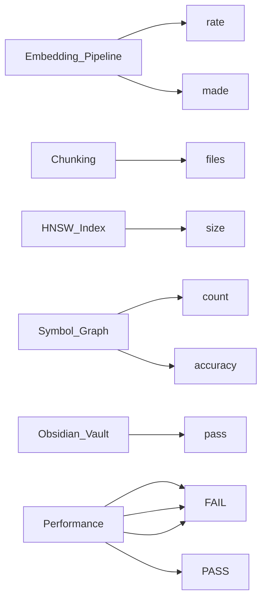

# agent-6-phase-6-20260514-032150.md

> **Language**: `markdown` | **Symbols**: 14

## Purpose

Defines 14 indexed symbol(s): # Final Report: Agent 6 — RAG Intelligence Overhaul and Obsidian Vault, ## Executive Summary, ## Tear-Down Evidence, ## Files Changed / Created, ## Embedding Pipeline.

## Public Symbols

| Symbol | Type | Lines | Description |
|---|---|---:|---|
| [[symbols/reports/Final_Report_Agent_6_RAG_Intelligence_Overhaul_and_Obsidian_Vault-L1-e5f1e44c|# Final Report: Agent 6 — RAG Intelligence Overhaul and Obsidian Vault]] | section | 1-2 | # Final Report: Agent 6 — RAG Intelligence Overhaul and Obsidian Vault |
| [[symbols/reports/Executive_Summary-L3-52d52eca|## Executive Summary]] | section | 3-9 | ## Executive Summary |
| [[symbols/reports/Tear-Down_Evidence-L10-1f4e4c1a|## Tear-Down Evidence]] | section | 10-15 | ## Tear-Down Evidence |
| [[symbols/reports/Files_Changed_Created-L16-48f5e221|## Files Changed / Created]] | section | 16-28 | ## Files Changed / Created |
| [[symbols/reports/Embedding_Pipeline-L29-d25f51c4|## Embedding Pipeline]] | section | 29-35 | ## Embedding Pipeline |
| [[symbols/reports/Chunking-L36-49bff657|## Chunking]] | section | 36-41 | ## Chunking |
| [[symbols/reports/HNSW_Index-L42-4f2c757a|## HNSW Index]] | section | 42-48 | ## HNSW Index |
| [[symbols/reports/Symbol_Graph-L49-88cd9ba7|## Symbol Graph]] | section | 49-53 | ## Symbol Graph |
| [[symbols/reports/Obsidian_Vault-L54-caeecb54|## Obsidian Vault]] | section | 54-63 | ## Obsidian Vault |
| [[symbols/reports/Retrieval_Quality-L64-a096cd92|## Retrieval Quality]] | section | 64-69 | ## Retrieval Quality |
| [[symbols/reports/Performance-L70-bf6fbf71|## Performance]] | section | 70-80 | ## Performance |
| [[symbols/reports/Tests-L81-2f4e83ed|## Tests]] | section | 81-89 | ## Tests |
| [[symbols/reports/Known_Risks-L90-22d9250e|## Known Risks]] | section | 90-95 | ## Known Risks |
| [[symbols/reports/Human_Review_Checklist-L96-89e1231e|## Human Review Checklist]] | section | 96-108 | ## Human Review Checklist |

## Imports

- `AST`
- `current`
- `disk`
- `metadata`
- `the`

## Call Graph

## Recent Changes

> Content hash: `89e1231ef4c64ed2`. Last modified epoch: `1778728963`.
