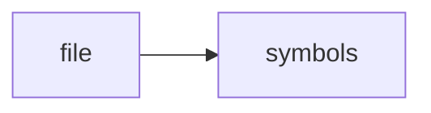

# document-1.md

> **Language**: `markdown` | **Symbols**: 18

## Purpose

Defines 18 indexed symbol(s): document, # Home - Crawl4AI Documentation (v0.8.x), # 🚀🤖 Crawl4AI: Open-Source LLM-Friendly Web Crawler & Scraper, #### 🚀 Crawl4AI Cloud API — Closed Beta (Launching Soon), ## 🆕 AI Assistant Skill Now Available!.

## Public Symbols

| Symbol | Type | Lines | Description |
|---|---|---:|---|
| [[symbols/research/extracted/ragd_ingest/document-L1-e7ec20a3|document]] | section | 1-8 | document |
| [[symbols/research/extracted/ragd_ingest/Home_-_Crawl4AI_Documentation_v0.8.x-L9-c7acf501|# Home - Crawl4AI Documentation (v0.8.x)]] | section | 9-12 | # Home - Crawl4AI Documentation (v0.8.x) |
| [[symbols/research/extracted/ragd_ingest/Crawl4AI_Open-Source_LLM-Friendly_Web_Crawler_Scraper-L13-3bfa80e1|# 🚀🤖 Crawl4AI: Open-Source LLM-Friendly Web Crawler & Scraper]] | section | 13-14 | # 🚀🤖 Crawl4AI: Open-Source LLM-Friendly Web Crawler & Scraper |
| [[symbols/research/extracted/ragd_ingest/Crawl4AI_Cloud_API_Closed_Beta_Launching_Soon-L15-b4709b5b|#### 🚀 Crawl4AI Cloud API — Closed Beta (Launching Soon)]] | section | 15-26 | #### 🚀 Crawl4AI Cloud API — Closed Beta (Launching Soon) |
| [[symbols/research/extracted/ragd_ingest/AI_Assistant_Skill_Now_Available-L27-3165213e|## 🆕 AI Assistant Skill Now Available!]] | section | 27-28 | ## 🆕 AI Assistant Skill Now Available! |
| [[symbols/research/extracted/ragd_ingest/Crawl4AI_Skill_for_Claude_AI_Assistants-L29-f46e2efd|### 🤖 Crawl4AI Skill for Claude & AI Assistants]] | section | 29-44 | ### 🤖 Crawl4AI Skill for Claude & AI Assistants |
| [[symbols/research/extracted/ragd_ingest/New_Adaptive_Web_Crawling-L45-ed9e00df|## 🎯 New: Adaptive Web Crawling]] | section | 45-50 | ## 🎯 New: Adaptive Web Crawling |
| [[symbols/research/extracted/ragd_ingest/Quick_Start-L51-10ad5c9d|## Quick Start]] | section | 51-58 | ## Quick Start |
| [[symbols/research/extracted/ragd_ingest/Create_an_instance_of_AsyncWebCrawler-L59-16170c11|# Create an instance of AsyncWebCrawler]] | section | 59-60 | # Create an instance of AsyncWebCrawler |
| [[symbols/research/extracted/ragd_ingest/Run_the_crawler_on_a_URL-L61-2afc55f2|# Run the crawler on a URL]] | section | 61-63 | # Run the crawler on a URL |
| [[symbols/research/extracted/ragd_ingest/Print_the_extracted_content-L64-1c05382e|# Print the extracted content]] | section | 64-66 | # Print the extracted content |
| [[symbols/research/extracted/ragd_ingest/Run_the_async_main_function-L67-92fa861b|# Run the async main function]] | section | 67-69 | # Run the async main function |
| [[symbols/research/extracted/ragd_ingest/Video_Tutorial-L70-7bb73278|## Video Tutorial]] | section | 70-71 | ## Video Tutorial |
| [[symbols/research/extracted/ragd_ingest/What_Does_Crawl4AI_Do-L72-3eeb9c37|## What Does Crawl4AI Do?]] | section | 72-85 | ## What Does Crawl4AI Do? |
| [[symbols/research/extracted/ragd_ingest/Documentation_Structure-L86-73f8df5c|## Documentation Structure]] | section | 86-109 | ## Documentation Structure |
| [[symbols/research/extracted/ragd_ingest/How_You_Can_Support-L110-b8d2e6a4|## How You Can Support]] | section | 110-123 | ## How You Can Support |
| [[symbols/research/extracted/ragd_ingest/Quick_Links-L124-5e4ed664|## Quick Links]] | section | 124-143 | ## Quick Links |
| [[symbols/research/extracted/ragd_ingest/Search-L144-20687ede|##### Search]] | section | 144-148 | ##### Search |

## Imports

- *(none indexed)*

## Call Graph

## Recent Changes

> Content hash: `20687ede58943f23`. Last modified epoch: `-4659044163779812509`.
