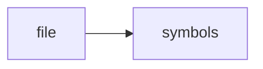

# 99431a0ac443fbe9.md

> **Language**: `markdown` | **Symbols**: 18

## Purpose

Defines 18 indexed symbol(s): document, # Home - Crawl4AI Documentation (v0.8.x), # 🚀🤖 Crawl4AI: Open-Source LLM-Friendly Web Crawler & Scraper, #### 🚀 Crawl4AI Cloud API — Closed Beta (Launching Soon), ## 🆕 AI Assistant Skill Now Available!.

## Public Symbols

| Symbol | Type | Lines | Description |
|---|---|---:|---|
| [[symbols/research/markdown/crawl4ai_docs/document-L1-2481f10f|document]] | section | 1-8 | document |
| [[symbols/research/markdown/crawl4ai_docs/Home_-_Crawl4AI_Documentation_v0.8.x-L9-db9142f9|# Home - Crawl4AI Documentation (v0.8.x)]] | section | 9-12 | # Home - Crawl4AI Documentation (v0.8.x) |
| [[symbols/research/markdown/crawl4ai_docs/Crawl4AI_Open-Source_LLM-Friendly_Web_Crawler_Scraper-L13-25c3e501|# 🚀🤖 Crawl4AI: Open-Source LLM-Friendly Web Crawler & Scraper]] | section | 13-14 | # 🚀🤖 Crawl4AI: Open-Source LLM-Friendly Web Crawler & Scraper |
| [[symbols/research/markdown/crawl4ai_docs/Crawl4AI_Cloud_API_Closed_Beta_Launching_Soon-L15-678f8d2d|#### 🚀 Crawl4AI Cloud API — Closed Beta (Launching Soon)]] | section | 15-26 | #### 🚀 Crawl4AI Cloud API — Closed Beta (Launching Soon) |
| [[symbols/research/markdown/crawl4ai_docs/AI_Assistant_Skill_Now_Available-L27-cd3084b9|## 🆕 AI Assistant Skill Now Available!]] | section | 27-28 | ## 🆕 AI Assistant Skill Now Available! |
| [[symbols/research/markdown/crawl4ai_docs/Crawl4AI_Skill_for_Claude_AI_Assistants-L29-b474c688|### 🤖 Crawl4AI Skill for Claude & AI Assistants]] | section | 29-44 | ### 🤖 Crawl4AI Skill for Claude & AI Assistants |
| [[symbols/research/markdown/crawl4ai_docs/New_Adaptive_Web_Crawling-L45-d7322f5d|## 🎯 New: Adaptive Web Crawling]] | section | 45-50 | ## 🎯 New: Adaptive Web Crawling |
| [[symbols/research/markdown/crawl4ai_docs/Quick_Start-L51-208fa4c8|## Quick Start]] | section | 51-58 | ## Quick Start |
| [[symbols/research/markdown/crawl4ai_docs/Create_an_instance_of_AsyncWebCrawler-L59-8e084fb1|# Create an instance of AsyncWebCrawler]] | section | 59-60 | # Create an instance of AsyncWebCrawler |
| [[symbols/research/markdown/crawl4ai_docs/Run_the_crawler_on_a_URL-L61-9732f1f9|# Run the crawler on a URL]] | section | 61-63 | # Run the crawler on a URL |
| [[symbols/research/markdown/crawl4ai_docs/Print_the_extracted_content-L64-a54605d4|# Print the extracted content]] | section | 64-66 | # Print the extracted content |
| [[symbols/research/markdown/crawl4ai_docs/Run_the_async_main_function-L67-ab91812e|# Run the async main function]] | section | 67-69 | # Run the async main function |
| [[symbols/research/markdown/crawl4ai_docs/Video_Tutorial-L70-e783fd23|## Video Tutorial]] | section | 70-71 | ## Video Tutorial |
| [[symbols/research/markdown/crawl4ai_docs/What_Does_Crawl4AI_Do-L72-d490c914|## What Does Crawl4AI Do?]] | section | 72-85 | ## What Does Crawl4AI Do? |
| [[symbols/research/markdown/crawl4ai_docs/Documentation_Structure-L86-5f164cf2|## Documentation Structure]] | section | 86-109 | ## Documentation Structure |
| [[symbols/research/markdown/crawl4ai_docs/How_You_Can_Support-L110-38cb12b0|## How You Can Support]] | section | 110-123 | ## How You Can Support |
| [[symbols/research/markdown/crawl4ai_docs/Quick_Links-L124-bd34da76|## Quick Links]] | section | 124-143 | ## Quick Links |
| [[symbols/research/markdown/crawl4ai_docs/Search-L144-8804fc69|##### Search]] | section | 144-148 | ##### Search |

## Imports

- *(none indexed)*

## Call Graph

## Recent Changes

> Content hash: `8804fc69a6eebb98`. Last modified epoch: `-4659044766439777965`.
