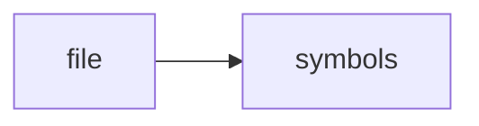

# cleaner.py

> **Language**: `python` | **Symbols**: 4

## Purpose

Defines 4 indexed symbol(s): top_level, strip_noise, clean_text, html_to_text_fallback.

## Public Symbols

| Symbol | Type | Lines | Description |
|---|---|---:|---|
| [[symbols/research_os/top_level-L1-6ce8ab5f|top_level]] | block | 1-11 | top_level |
| [[symbols/research_os/strip_noise-L12-5a3a2110|strip_noise]] | function | 12-15 | strip_noise |
| [[symbols/research_os/clean_text-L16-7c2d2d32|clean_text]] | function | 16-23 | clean_text |
| [[symbols/research_os/html_to_text_fallback-L24-3c586cb4|html_to_text_fallback]] | function | 24-34 | html_to_text_fallback |

## Imports

- *(none indexed)*

## Call Graph

## Recent Changes

> Content hash: `3c586cb4a419fa5e`. Last modified epoch: `-4659044796967776979`.
