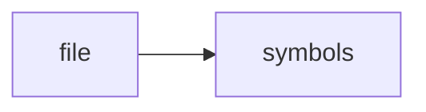

# ollama_client.py

> **Language**: `python` | **Symbols**: 2

## Purpose

Defines 2 indexed symbol(s): top_level, summarize.

## Public Symbols

| Symbol | Type | Lines | Description |
|---|---|---:|---|
| [[symbols/research_os/top_level-L1-d8cf6398|top_level]] | block | 1-3 | top_level |
| [[symbols/research_os/summarize-L4-b97d483f|summarize]] | function | 4-9 | summarize |

## Imports

- *(none indexed)*

## Call Graph

## Recent Changes

> Content hash: `b97d483fc6411708`. Last modified epoch: `-4659044796967776979`.
