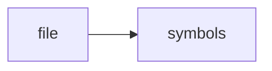

# scheduler.py

> **Language**: `python` | **Symbols**: 4

## Purpose

Defines 4 indexed symbol(s): top_level, _source_from_row, _write, run.

## Public Symbols

| Symbol | Type | Lines | Description |
|---|---|---:|---|
| [[symbols/research_os/top_level-L1-ac6b8a53|top_level]] | block | 1-13 | top_level |
| [[symbols/research_os/source_from_row-L14-1c727ed9|_source_from_row]] | function | 14-23 | _source_from_row |
| [[symbols/research_os/write-L24-1aae5e3c|_write]] | function | 24-29 | _write |
| [[symbols/research_os/run-L30-95230d71|run]] | function | 30-90 | run |

## Imports

- *(none indexed)*

## Call Graph

## Recent Changes

> Content hash: `95230d71b7f69a78`. Last modified epoch: `-4659044796967776979`.
