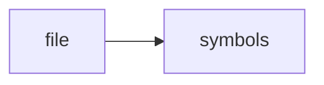

# dominion-ui

> **Language**: `text` | **Symbols**: 1

## Purpose

Defines 1 indexed symbol(s): file.

## Public Symbols

| Symbol | Type | Lines | Description |
|---|---|---:|---|
| [[symbols/scripts/bin/file-L1-67a49d71|file]] | block | 1-3 | file |

## Imports

- *(none indexed)*

## Call Graph

## Recent Changes

> Content hash: `67a49d71543a6f34`. Last modified epoch: `-4659044369523801551`.
