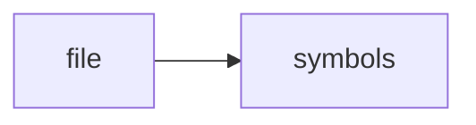

# codexrag.py

> **Language**: `python` | **Symbols**: 3

## Purpose

Defines 3 indexed symbol(s): top_level, query, main.

## Public Symbols

| Symbol | Type | Lines | Description |
|---|---|---:|---|
| [[symbols/scripts/top_level-L1-37f777fb|top_level]] | block | 1-8 | top_level |
| [[symbols/scripts/query-L9-f39e62f4|query]] | function | 9-15 | query |
| [[symbols/scripts/main-L16-8302e799|main]] | function | 16-39 | main |

## Imports

- *(none indexed)*

## Call Graph

## Recent Changes

> Content hash: `8302e799b4ee6b9`. Last modified epoch: `-4659044369527801552`.
