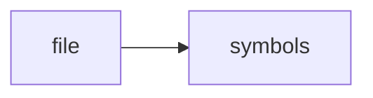

# dominion_cli.py

> **Language**: `python` | **Symbols**: 19

## Purpose

Defines 19 indexed symbol(s): top_level, run, http_json, ragd_health, tmux_sessions.

## Public Symbols

| Symbol | Type | Lines | Description |
|---|---|---:|---|
| [[symbols/scripts/top_level-L1-f6ef8482|top_level]] | block | 1-18 | top_level |
| [[symbols/scripts/run-L19-7ceb3286|run]] | function | 19-26 | run |
| [[symbols/scripts/http_json-L27-2bfe46a8|http_json]] | function | 27-36 | http_json |
| [[symbols/scripts/ragd_health-L37-6b52174c|ragd_health]] | function | 37-40 | ragd_health |
| [[symbols/scripts/tmux_sessions-L41-587efdb3|tmux_sessions]] | function | 41-44 | tmux_sessions |
| [[symbols/scripts/research_counts-L45-19f1d041|research_counts]] | function | 45-60 | research_counts |
| [[symbols/scripts/codex_config_status-L61-ecd92cdf|codex_config_status]] | function | 61-65 | codex_config_status |
| [[symbols/scripts/print_json-L66-17174ca5|print_json]] | function | 66-69 | print_json |
| [[symbols/scripts/cmd_status-L70-45ac81f8|cmd_status]] | function | 70-101 | cmd_status |
| [[symbols/scripts/cmd_start-L102-f3efeda8|cmd_start]] | function | 102-121 | cmd_start |
| [[symbols/scripts/cmd_doctor-L122-fd56366d|cmd_doctor]] | function | 122-142 | cmd_doctor |
| [[symbols/scripts/cmd_tmux-L143-3a82c1c2|cmd_tmux]] | function | 143-148 | cmd_tmux |
| [[symbols/scripts/cmd_codex-L149-699a0200|cmd_codex]] | function | 149-159 | cmd_codex |
| [[symbols/scripts/cmd_ragd-L160-14cb8fbf|cmd_ragd]] | function | 160-164 | cmd_ragd |
| [[symbols/scripts/cmd_research-L165-5113c8d6|cmd_research]] | function | 165-170 | cmd_research |
| [[symbols/scripts/cmd_data-L171-22365e3f|cmd_data]] | function | 171-177 | cmd_data |
| [[symbols/scripts/cmd_llm-L178-3a498126|cmd_llm]] | function | 178-182 | cmd_llm |
| [[symbols/scripts/build_parser-L183-4ff6e6b6|build_parser]] | function | 183-207 | build_parser |
| [[symbols/scripts/main-L208-7854718e|main]] | function | 208-214 | main |

## Imports

- *(none indexed)*

## Call Graph

## Recent Changes

> Content hash: `7854718ed8bd0784`. Last modified epoch: `-4659044369527801552`.
