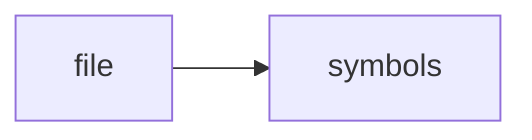

# dominion_ui.py

> **Language**: `python` | **Symbols**: 4

## Purpose

Defines 4 indexed symbol(s): top_level, run, render, main.

## Public Symbols

| Symbol | Type | Lines | Description |
|---|---|---:|---|
| [[symbols/scripts/top_level-L1-b7385c1b|top_level]] | block | 1-10 | top_level |
| [[symbols/scripts/run-L11-fa68d859|run]] | function | 11-18 | run |
| [[symbols/scripts/render-L19-b2859479|render]] | function | 19-35 | render |
| [[symbols/scripts/main-L36-a02e8e62|main]] | function | 36-54 | main |

## Imports

- *(none indexed)*

## Call Graph

## Recent Changes

> Content hash: `a02e8e6237604b1c`. Last modified epoch: `-4659044369527801552`.
