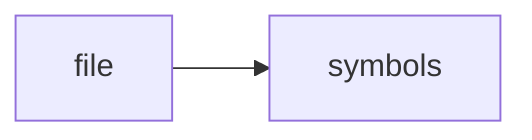

# README.md

> **Language**: `markdown` | **Symbols**: 1

## Purpose

Defines 1 indexed symbol(s): # Test.

## Public Symbols

| Symbol | Type | Lines | Description |
|---|---|---:|---|
| [[symbols/tmp/pytest-of-Martin/pytest-15/test_second_scan_unchanged_fil0/repo/Test-L1-addc6d6e|# Test]] | section | 1-1 | # Test |

## Imports

- *(none indexed)*

## Call Graph

## Recent Changes

> Content hash: `addc6d6ec028ce69`. Last modified epoch: `-4658953923544846737`.
